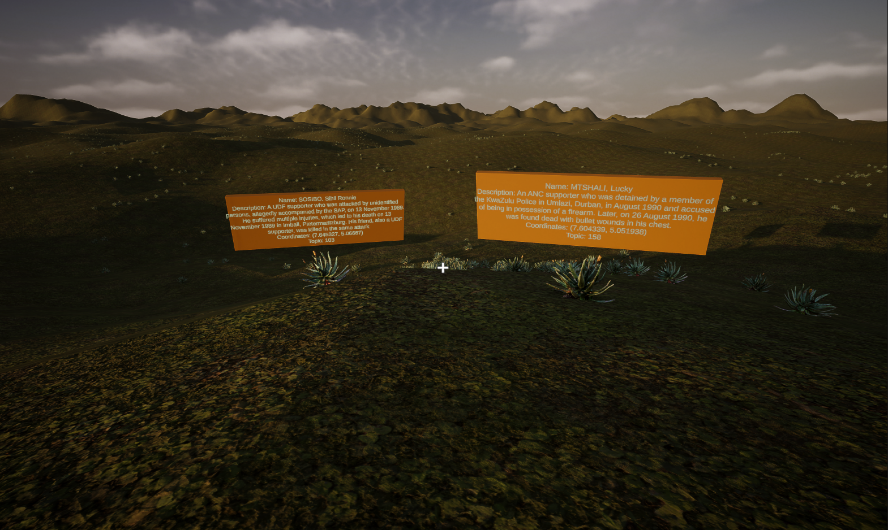
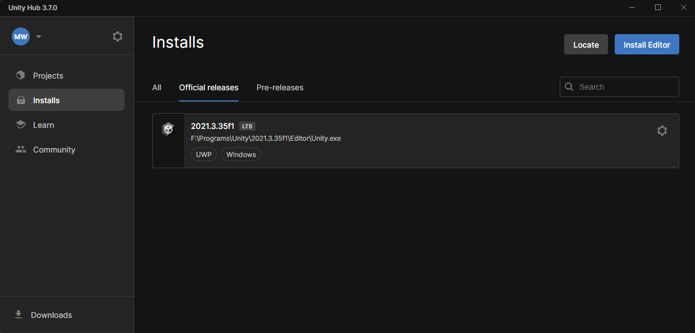

# Bitter-Aloe

### About the Project
This project is a creation of the Bitter Aloe Project Team and their commitment towards visualizing testimonies of the  atrocities of apartheid South Africa. The goal of this project is to present a 3D space reminiscent of a South African landscape, with markers (Bitter Aloe Plants), that share testimony data from South Africa's Truth and Reconcialiation Commission (TRC) archive. The project is made with Unity and designed by University of Kentucky Computer Science students as part of their CS499 Senior Design Class. 
More information can be found online at https://bitteraloeproject.createuky.net/

Demo Videos at `Docs/Demos`

### Building the Project
In order to build the project, a few pieces of software are needed. First Unity hub and a subsequent Unity version are needed. Unity Hub can be found here: https://unity.com/download

Our project uses a specific version of the Unity Editor. Specifically the Unity 2021.3.X LTS Version. Download the newest 2021 LTS version in Unity Hub. The install should also install Visual Studio 2019 for code editing.

To clone the repository, install `git` or [Github Desktop](https://desktop.github.com/). If on command line, clone with the following command: 
`git clone https://github.com/anna0021/Bitter-Aloe.git`

Open the project in Unity Hub with the correct version, and the project will load. Press the Unity Play button at the top of the window and the scene will load. Congrats! The project is built.

### Working Features
 - Player Movement (Walking, Sprinting, Jumping)
 - Plant Marker Spawning (Up to 20000 data points)
 - Marker Popup displays
 - Time of Day Skybox and Animation
 - Basic Main Menu and Pause Menu (No Options yet) 

### Useful Software to Install
 - [Unity](https://unity.com/download)
 - [Visual Studio Code](https://code.visualstudio.com/)
 - [GitHub Desktop](https://desktop.github.com/)
 - [Blender](https://www.blender.org/download/) for 3D modeling.

### CS499 Contributors
#### Spring 2024
 - Matthew Whalen ([mrwhalen22](https://github.com/mrwhalen22)) 
 - Anna Thompson
 - Ethan Tate 
 - Cameron Egbert
 - Todd Jackson
#### Fall 2023
 - Reece Allen
 - Pranneth Bhatt
 - Destyn Carlton
 - Jed Antonio
 - Luke Olsen

